```{r setup, include=FALSE}
knitr::opts_chunk$set(echo = FALSE, warning = FALSE, message = FALSE)
```
This tutorial describes the current CompoundVision3D UI workflow from raw image-volume data to checked facet positions, head landmarks, optical metrics, corneal projections, mirroring, and analysis-ready export. It is written for external beta testers using the bundled pre-release application.

> **Current scope**  
> This guide focuses on the image-volume workflow using Fiji/ImageJ, Blender, R, and the CompoundVision3D R package. STL-source datasets are mentioned briefly, but the main tutorial assumes that the dataset starts from an image stack or volume.

---

# Overview

CompoundVision3D is an interactive workflow for extracting compound-eye surface information from 3D image data. The current UI coordinates several tools:

- **Fiji/ImageJ** for image-volume preprocessing and STL extraction.
- **Blender** for manual cornea extraction, facet-position checking, and head landmarking.
- **R** and the **CompoundVision3D R package** for local-height calculations, thresholding, candidate detection, optical metrics, coordinate rotation, corneal projections, and visual quality control.

The main workflow is:

```text
Raw image volume
-> ImageJ preprocessing
-> ImageJ STL extraction for head and eyes
-> Blender cornea extraction
-> R local-height calculation
-> optional R local-height normalization
-> R local-height thresholding
-> R facet candidate condensation
-> Blender facet position checking
-> Blender head landmarking
-> R optical metrics (05A)
-> R global coordinate rotation (05B)
-> R corneal projections (05C)
-> optional eye mirroring
-> Results / Export: analysis-ready tables and QC report
```

```{r fig-01-workflow-overview, fig.cap="Overview of the CompoundVision3D workflow from raw image data to analysis-ready compound-eye outputs.", out.width="66%", fig.align="center", fig.pos="H"}
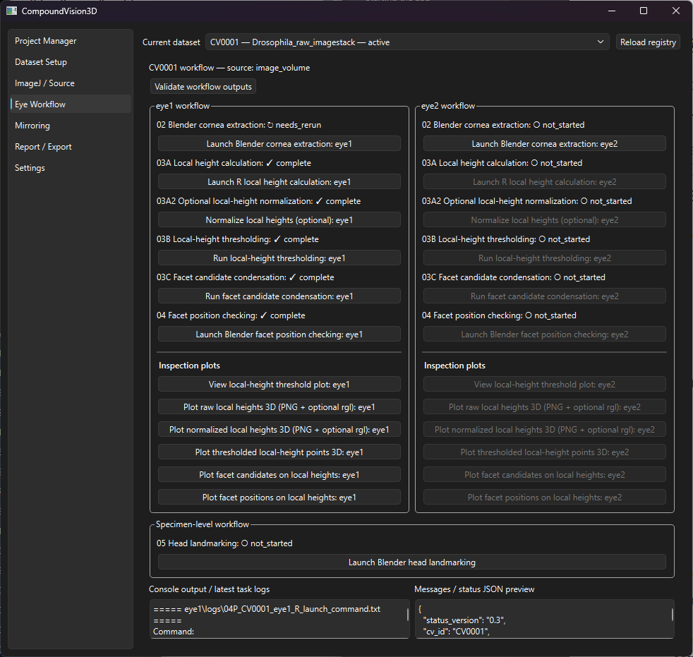
```
---

# Required software

Install the following before using the UI:

1. **Python** with `PySide6`.
2. **Fiji/ImageJ**.
3. **Blender**.
4. **R** with access to `Rscript.exe`.
5. The **CompoundVision3D R package**, installed from GitHub through the app settings.

On Windows, typical executable paths look like:

```text
Fiji/ImageJ:
C:\Users\<user>\Fiji.app\ImageJ-win64.exe

Blender:
C:\Program Files\Blender Foundation\Blender <version>\blender.exe

Rscript:
C:\Program Files\R\R-<version>\bin\Rscript.exe
```

For Fiji/ImageJ, the current mesh extraction workflow uses the **3D Viewer** for threshold preview and manual STL export. Make sure the 3D Viewer is available in your Fiji installation.

---

# Folder structure of the pre-release bundle

The pre-release bundle should look like this:

```text
CompoundVision3D_UI_prerelease/
|--- CV3D_app.py
|--- README.md
|--- cv3d_helpers/
   |--- imagej/
   |  |--- CV3D_ij_preprocess.ijm
   |  |--- CV3D_ij_mesh.ijm
   |--- blender/
   |  |--- CV3D_blender.py
   |--- r/
      |--- CV3D_R_03A_heights.R
      |--- CV3D_R_03A_plot_raw.R
      |--- CV3D_R_03A2_normalize.R
      |--- CV3D_R_03A2_plot_norm.R
      |--- CV3D_R_03B_threshold.R
      |--- CV3D_R_03B_plot_threshold.R
      |--- CV3D_R_03C_candidates.R
      |--- CV3D_R_QC_facet_overlay.R
      |--- CV3D_R_05A_metrics.R
      |--- CV3D_R_05A_QC_plots.R
      |--- CV3D_R_05B_align.R
      |--- CV3D_R_05B_QC_plots.R
      |--- CV3D_R_05C_projection.R
      |--- CV3D_R_05C_QC_plots.R
```

Only `CV3D_app.py` needs to be started directly. The helper scripts are detected automatically when they remain in the `cv3d_helpers/` folder.

---

# Starting the app

Open a terminal in the `CompoundVision3D_UI_prerelease/` folder and run:

```bash
python CV3D_app.py
```

The app opens with the left navigation panel and the main workflow area.

```{r fig-03-start-screen, fig.cap="Start screen of the CompoundVision3D UI.", out.width="66%", fig.align="center", fig.pos="H"}
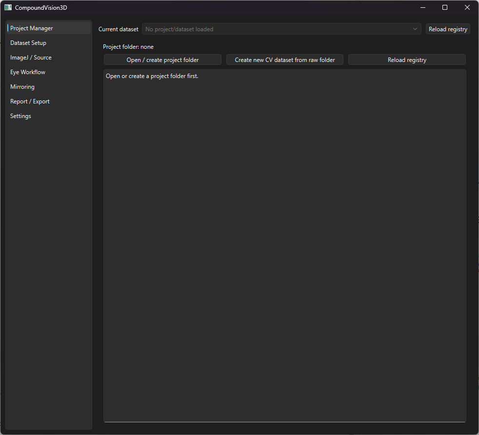
```
---

# Initial settings

Open the **Settings** page before running the first dataset.

Set the following executable paths:

- **ImageJ/Fiji executable**
- **Blender executable**
- **Rscript executable**

Then click:

```text
Use bundled helper scripts
```

This fills the helper-script paths automatically from the `cv3d_helpers/` folder. Bundled helper paths are stored as relative paths, for example `cv3d_helpers/r/CV3D_R_05C_QC_plots.R`. Executable paths such as Fiji, Blender, and Rscript remain normal system paths because they are outside the bundle.

Then click:

```text
Check R setup
```

If the CompoundVision3D R package is missing, use:

```text
Install/update from GitHub
```

The default GitHub repository is:

```text
Pete-s-Lab/CV3D
```

The GitHub repository is now named `CV3D`; the installed R package namespace is still `CompoundVision3D` unless the package itself is renamed later.

```{r fig-04-settings-page, fig.cap="Settings page. Only executable paths usually need to be set manually; helper scripts can be loaded from the bundled folder.", out.width="66%", fig.align="center", fig.pos="H"}
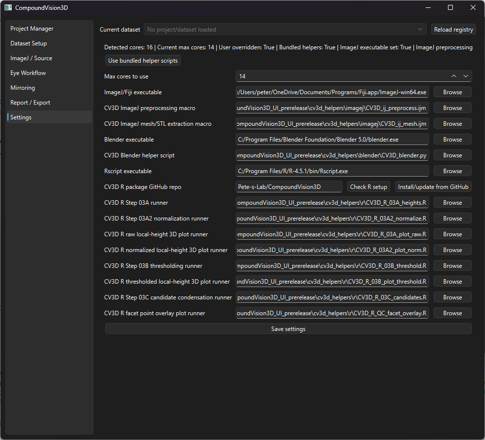
```
---

# Creating or opening a project

Go to **Project Manager**.

Click:

```text
Open / create project folder
```

Choose a folder that will contain the project registry and all CV datasets.

The app creates or loads:

```text
CV3D_project_registry.json
```

This registry stores all datasets in the current project.

```{r fig-05-project-manager, fig.cap="Project Manager page after opening a CompoundVision3D project folder.", out.width="66%", fig.align="center", fig.pos="H"}
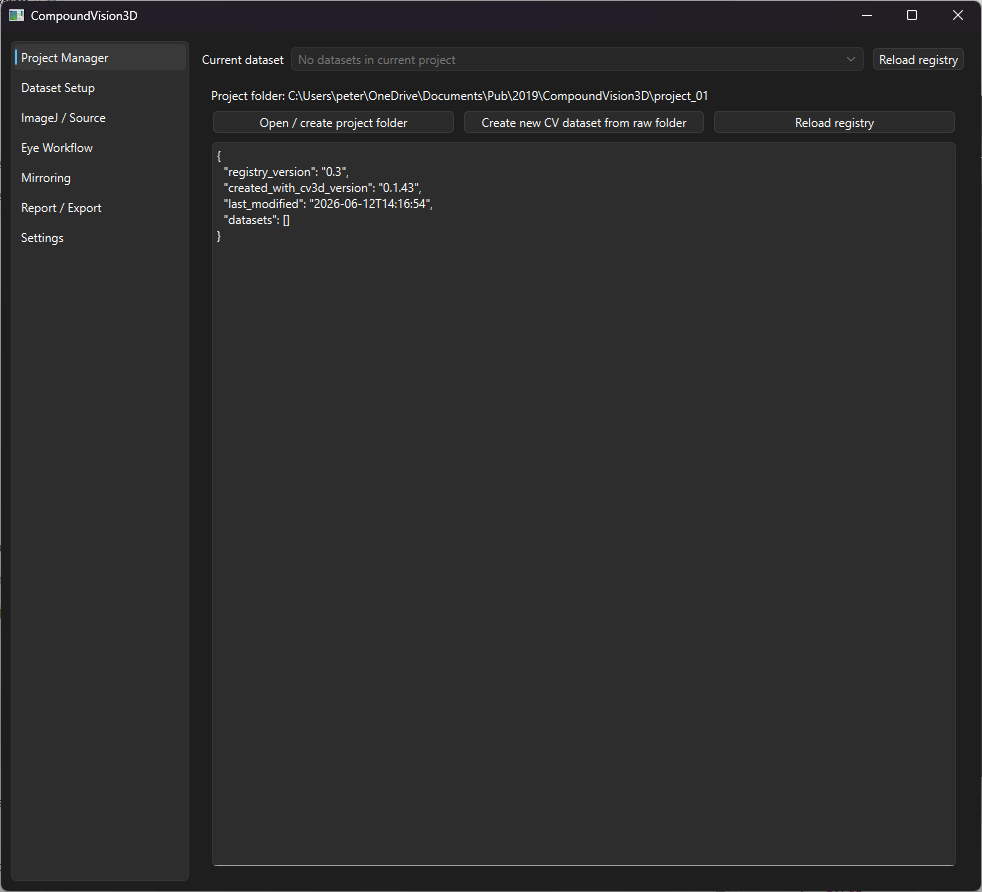
```
---

# Creating a new CV dataset

In **Project Manager**, click:

```text
Create new CV dataset from raw folder
```

Select the raw-data folder for one specimen or dataset. The app assigns the next available CV ID, for example:

```text
CV0001
CV0002
CV0003
```

For each dataset, the app creates an analysis folder, for example:

```text
raw_dataset_01_two_eyes_image_volume/
|--- CV0001_CV3D/
```

This `CVxxxx_CV3D` folder becomes the main analysis folder for that dataset.

```{r fig-06-create-dataset, fig.cap="Creating a new CV dataset from a raw-data folder.", out.width="66%", fig.align="center", fig.pos="H"}
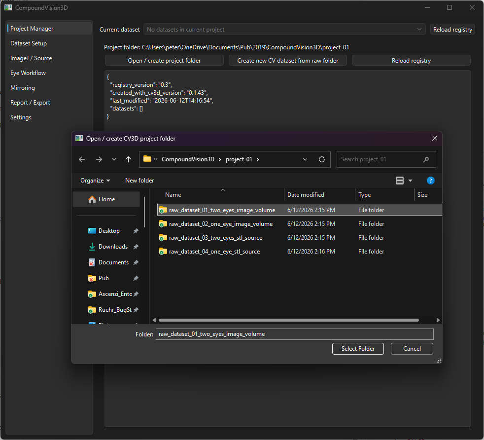
```
---

# Dataset metadata and eye inventory

Go to **Dataset Setup**.

Check:

- source type
- source notes
- eye presence
- anatomical side, if known
- notes for each eye

The current image-volume workflow normally uses:

```text
source_type = image_volume
```

Mark only eyes that are present in the dataset. The workflow buttons for absent eyes should remain disabled.

Click:

```text
Save dataset metadata / eye inventory
```

```{r fig-07-dataset-setup, fig.cap="Dataset setup page with source information and eye inventory.", out.width="66%", fig.align="center", fig.pos="H"}
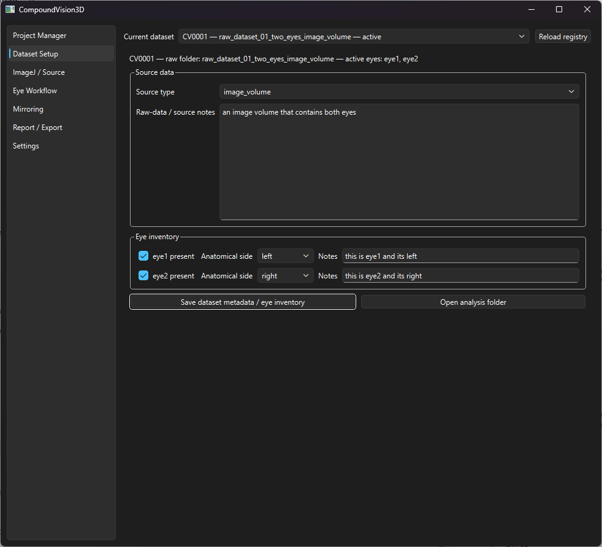
```
---

# ImageJ preprocessing

Go to **ImageJ / Source**.

Click:

```text
Launch ImageJ/Fiji preprocessing
```

This opens Fiji/ImageJ and runs the preprocessing macro. The macro performs the interactive image-volume preparation. It creates cropped NRRD files for the head and present eyes and stores the facet-size estimate.

Expected important outputs include:

```text
CVxxxx_CV3D/01_CVxxxx_head.nrrd
CVxxxx_CV3D/01_CVxxxx_facet_size_estimate.csv
CVxxxx_CV3D/eye1/01_CVxxxx_eye1.nrrd
CVxxxx_CV3D/eye2/01_CVxxxx_eye2.nrrd
```

During ROI selection, if no rectangular ROI is selected, the macro should ask again instead of aborting.

```{r fig-08-imagej-preprocessing-roi, fig.cap="ImageJ preprocessing. The user selects head and eye ROIs interactively.", out.width="66%", fig.align="center", fig.pos="H"}
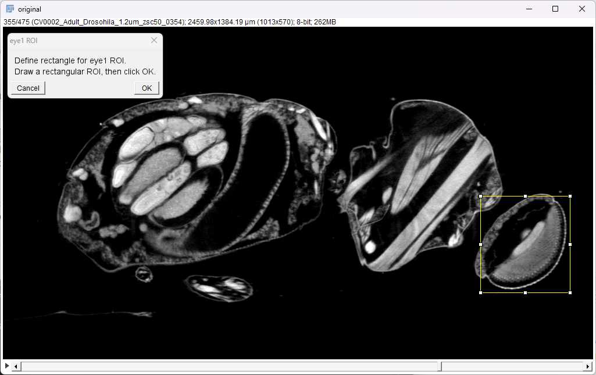
```
```{r fig-09-facet-size-estimation, fig.cap="Facet-size estimation. The selected line length is used as the facet-size estimate.", out.width="66%", fig.align="center", fig.pos="H"}
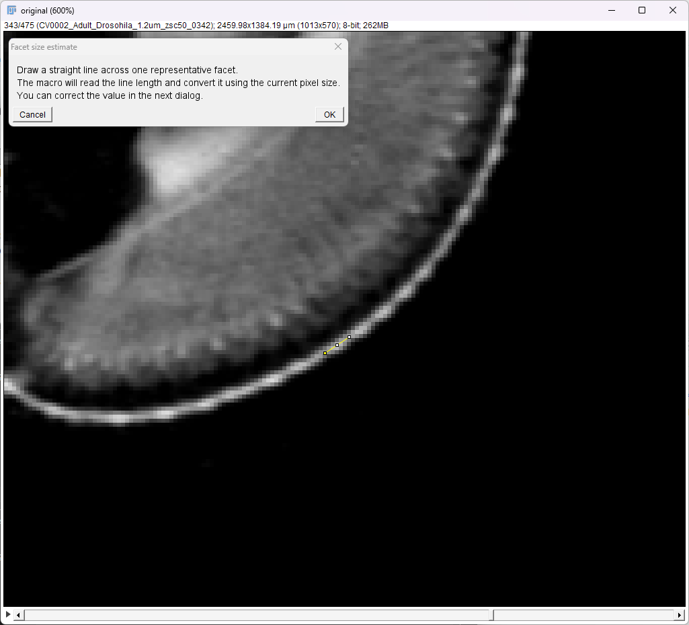
```
---

# ImageJ STL extraction

After preprocessing, still on the **ImageJ / Source** page, click:

```text
Launch ImageJ/Fiji STL extraction
```

Choose one of the available targets:

```text
head + present eyes
head
eye1
eye2
```

The STL extraction macro uses a downscaled 3D Viewer preview to find a suitable threshold quickly. After the threshold is accepted, the final full-resolution 3D Viewer workflow is used for mesh export.

Expected outputs:

```text
CVxxxx_CV3D/01_CVxxxx_head_ImageJ.stl
CVxxxx_CV3D/eye1/01_CVxxxx_eye1_ImageJ.stl
CVxxxx_CV3D/eye2/01_CVxxxx_eye2_ImageJ.stl
```

Status and logs should be written into `json/` and `logs/` folders, not mixed with scientific outputs.

For example:

```text
CVxxxx_CV3D/json/01MESH_CVxxxx_head_ImageJ_status.json
CVxxxx_CV3D/logs/01MESH_CVxxxx_head_ImageJ_status.txt
CVxxxx_CV3D/eye1/json/01MESH_CVxxxx_eye1_ImageJ_status.json
CVxxxx_CV3D/eye1/logs/01MESH_CVxxxx_eye1_ImageJ_status.txt
```

```{r fig-10-3dviewer-threshold-preview, fig.cap="Downscaled 3D Viewer preview used for fast threshold selection.", out.width="66%", fig.align="center", fig.pos="H"}
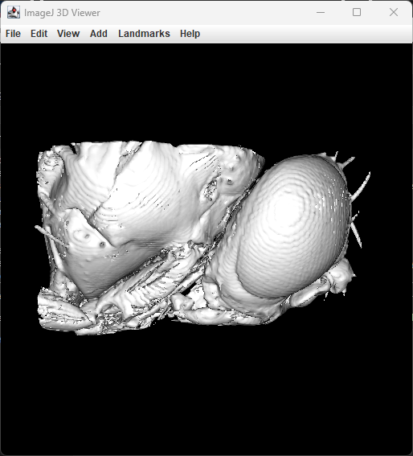
```
```{r fig-11-3dviewer-final-export, fig.cap="Final full-resolution 3D Viewer surface export. Save the STL to the expected CV3D path shown by the macro.", out.width="66%", fig.align="center", fig.pos="H"}
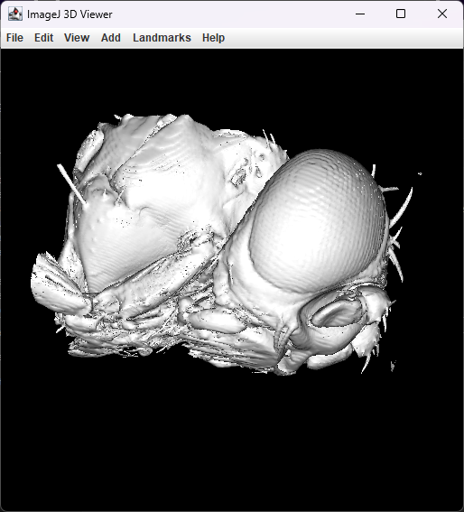
```
---

# Checking ImageJ/source outputs

Click:

```text
Check ImageJ/source outputs
```

The app checks whether expected source files exist. This check is intentionally lightweight for large STL files. It checks existence and file size rather than parsing the full STL.

The report should show whether the following files exist:

- head NRRD
- head STL
- facet-size estimate CSV
- eye NRRDs
- eye STLs
- selected raw STL for Step 02

```{r fig-12-source-output-check, fig.cap="Source/output check report after ImageJ preprocessing and STL extraction.", out.width="66%", fig.align="center", fig.pos="H"}
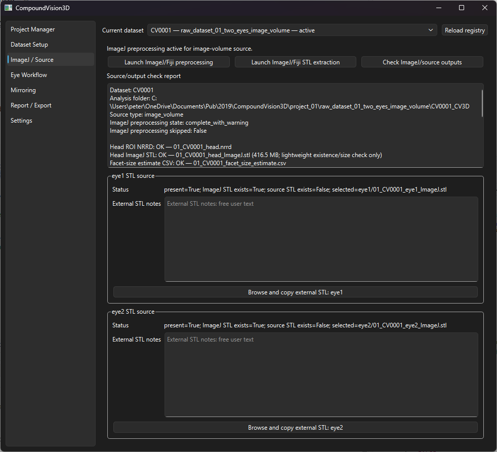
```
---

# Step 02: Blender cornea extraction

Go to **Eye Workflow**.

For each present eye, click:

```text
Launch Blender cornea extraction: eyeX
```

Blender opens with the CV3D helper panel. Use the panel to:

1. Import or continue from the source STL.
2. Select the corneal region manually.
3. Separate the selected region as the cornea.
4. Add/update export modifiers if needed.
5. Recalculate normals.
6. Export the selected cornea and save the `.blend` file.

Expected outputs:

```text
CVxxxx_CV3D/eyeX/02_CVxxxx_eyeX_cornea.blend
CVxxxx_CV3D/eyeX/02_CVxxxx_eyeX_cornea.stl
CVxxxx_CV3D/eyeX/json/02_CVxxxx_eyeX_Blender_task.json
CVxxxx_CV3D/eyeX/json/02_CVxxxx_eyeX_Blender_status.json
```

If an existing Blender file is found, the app should warn before overwriting. The safest option is usually:

```text
Open existing and continue
```

```{r fig-13-blender-cornea-extraction, fig.cap="Blender helper panel for cornea extraction.", out.width="33%", fig.align="center", fig.pos="H"}
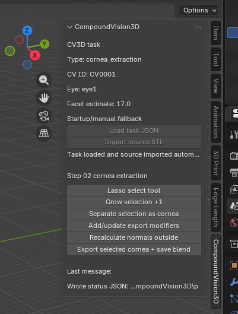
```
```{r fig-14-cornea-selection, fig.cap="Manual cornea selection before separating the corneal mesh.", out.width="75%", fig.align="center", fig.pos="H"}
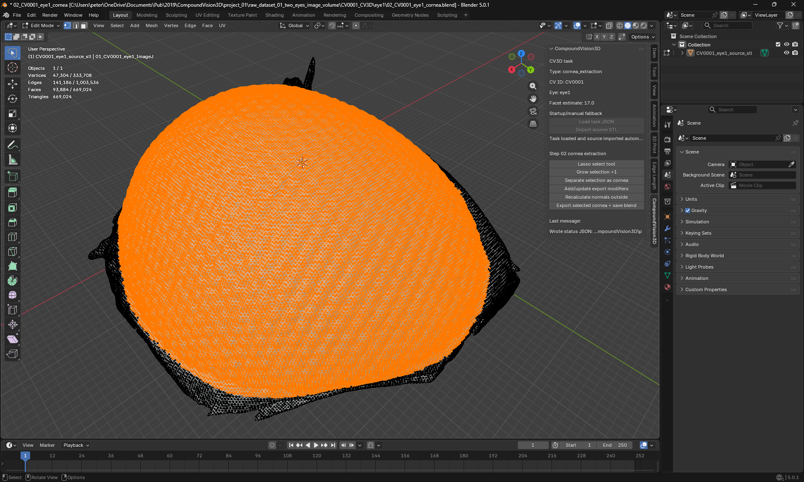
```
```{r fig-13-2-blender-modifiers, fig.cap="Blender modifier setup.", out.width="75%", fig.align="center", fig.pos="H"}
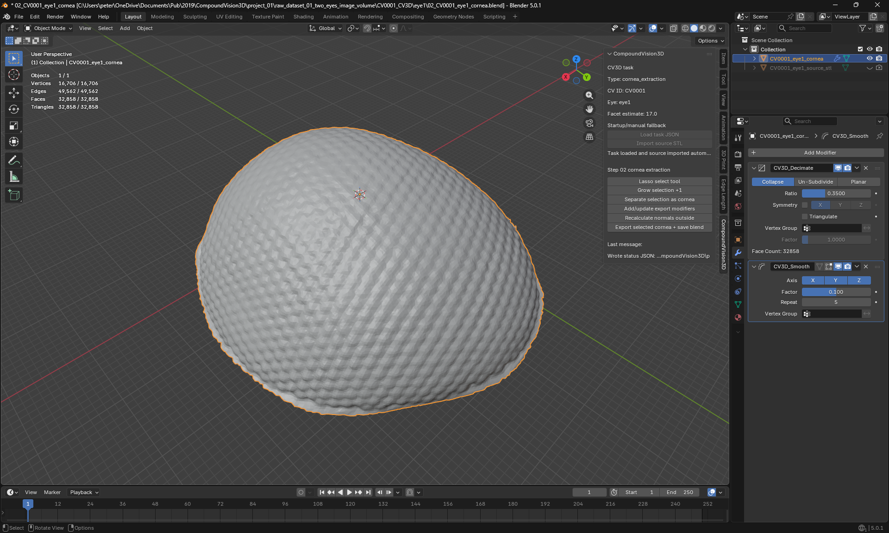
```
---

# Step 03A: Local-height calculation

After Step 02 is complete, click:

```text
Launch R local height calculation: eyeX
```

The app asks for the local-height search diameter. The default is based on the facet-size estimate:

```text
local-height search diameter = facet_size_estimate x 3
```

This step converts the corneal STL into triangle/normal points and calculates local heights.

Expected outputs:

```text
CVxxxx_CV3D/eyeX/03_CVxxxx_eyeX_triangles_normals.csv
CVxxxx_CV3D/eyeX/03_CVxxxx_eyeX_local_heights.csv
CVxxxx_CV3D/eyeX/inspection/03_CVxxxx_eyeX_local_height_threshold_plot.png
```

The search diameter should be large enough to cover a meaningful local neighbourhood, but not so large that separate local structures are over-smoothed.

```{r fig-15-local-height-search-diameter, fig.cap="Prompt for the local-height search diameter of Step 03A. Left: raw local height values. Right: log-transformed, percentile-clipped local heights.", out.width="33%", fig.align="center", fig.pos="H"}
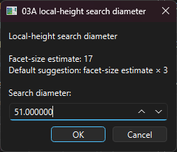
```

```{r fig-15-2-local-heights, fig.cap="Results of local heights calculation Step 03A. Left: raw local height values. Right: log-transformed, percentile-clipped local heights.", out.width="66%", fig.align="center", fig.pos="H"}
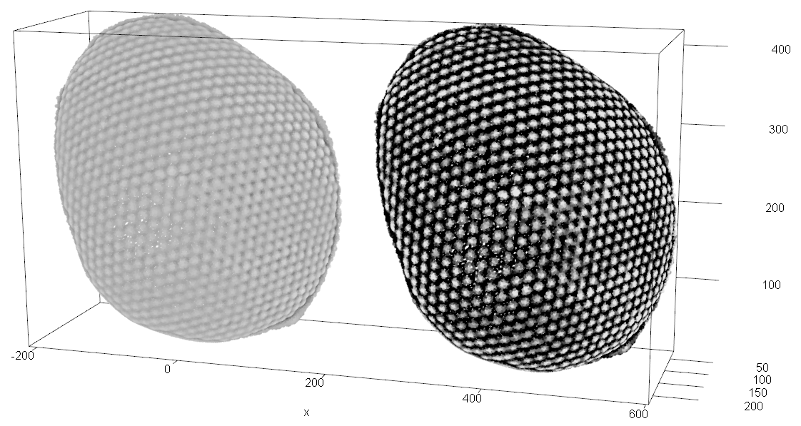
```
---

# Step 03A2: Optional local-height normalization

After Step 03A, click:

```text
Normalize local heights (optional): eyeX
```

This creates a normalized local-height table that can be used for thresholding. Normalization is optional, but often useful when raw local-height values vary strongly across the surface.

Expected output:

```text
CVxxxx_CV3D/eyeX/03_CVxxxx_eyeX_local_heights_normalized.csv
```

```{r fig-16-normalized-local-heights, fig.cap="Normalized local-height values shown as a 3D quality-control plot. Left: raw local height values. Middle: log-transformed, percentile-clipped local heights. Right: normalized log-transformed, percentile-clipped local heights.", out.width="85%", fig.align="center", fig.pos="H"}
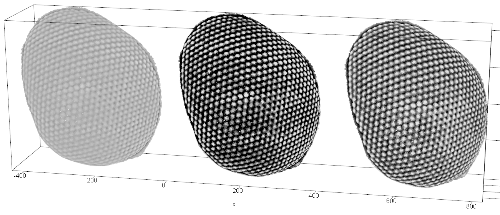
```
---

# Step 03B: Local-height thresholding

Click:

```text
Run local-height thresholding: eyeX
```

The app asks whether to threshold:

- raw local heights, or
- normalized local heights, if available

If normalized local heights are present, they should be selected by default. If not, raw local heights are used.

The first prompt asks for a preview threshold range:

```text
normalized values: default 0 to 1
raw values: default 5 to 30
```

```{r fig-17-1-threshold-prompt, fig.cap="Prompt for the local height thresholding of Step 03B.", out.width="40%", fig.align="center", fig.pos="H"}
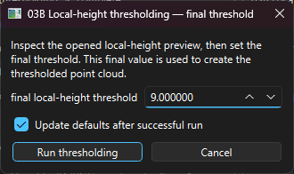
```

The app creates and opens a threshold preview. After inspecting it, choose the final threshold.

Expected output:

```text
CVxxxx_CV3D/eyeX/03_CVxxxx_eyeX_local_height_thresholded.csv
CVxxxx_CV3D/eyeX/inspection/03B_CVxxxx_eyeX_local_height.png
```

```{r fig-17-threshold-preview, fig.cap="Local-height threshold preview. The final threshold is chosen after inspecting this plot. Here, we will choose thresold = 9 as it separates facet peaks from the valleys around the facets.", out.width="100%", fig.align="center", fig.pos="H"}
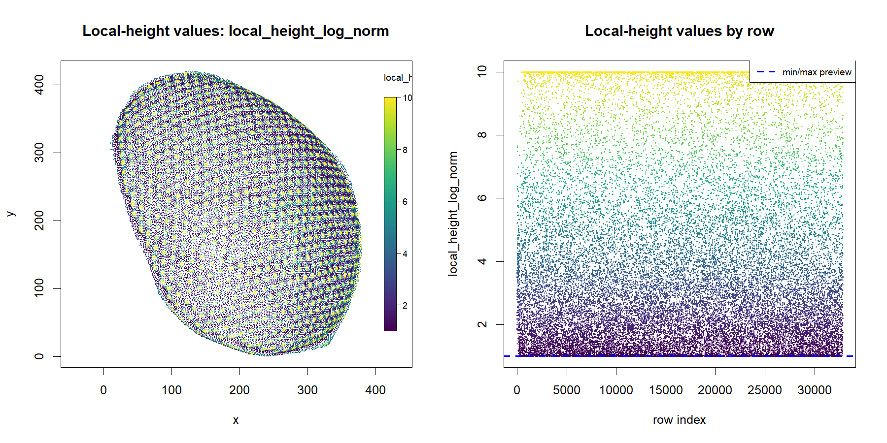
```
```{r fig-18-thresholded-points, fig.cap="Final thresholded local-height points after Step 03B.", out.width="50%", fig.align="center", fig.pos="H"}
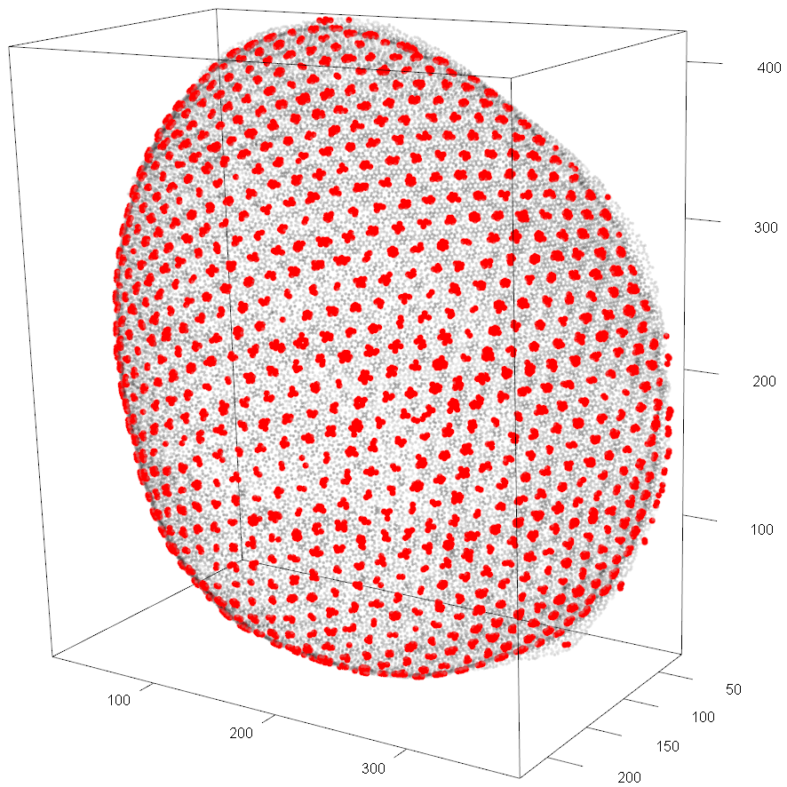
```
---

# Step 03C: Facet candidate condensation

Click:

```text
Run facet candidate condensation: eyeX
```

Step 03C reduces the thresholded local-height point cloud from Step 03B to one candidate point per likely ommatidium/facet. The function does this by iteratively moving nearby high local-height points toward local density modes and then merging points that have converged to the same local maximum.

## Parameters

### Neighbour radius

The neighbour radius defines the local search radius around each thresholded point. During each condensation iteration, every point looks for neighbouring points within this radius and moves toward their height-weighted local centre.

A good default is:

```text
0.5 x facet diameter estimate
```

For example, if the facet diameter estimate is 17, a good starting value is 8.5.

Smaller values keep nearby facets more separate but may leave too many candidate points. Larger values merge the point cloud more strongly but can fuse neighbouring facets if set too high.

### Merge radius

The merge radius defines how close condensed points must be after convergence to be treated as the same candidate. It is applied after the iterative movement step.

A good default is:

```text
0.3 x facet diameter estimate
```

For example, if the facet diameter estimate is 17, a good starting value is 5.1.

If the output contains too many duplicate candidates per facet, increase the merge radius slightly. If neighbouring facets are fused into one candidate, decrease the merge radius.

### Height-weight exponent

This controls how strongly local-height values influence the movement of points during condensation.

A value of:

```text
2
```

is a good default. It gives stronger influence to points with high local-height values, so points tend to converge toward local peaks rather than toward the simple geometric centre of all neighbours.

Lower values make the movement more spatially even. Higher values make the highest local-height points dominate more strongly.

### Maximum iterations

This is the maximum number of condensation iterations. In each iteration, points are moved toward local height-weighted centres. The process may stop earlier if the points no longer move meaningfully.

A good default is:

```text
8
```

Increasing this value can help if points have not fully converged, but it also increases runtime.

### Step size

The step size controls how far each point moves toward its local weighted centre in each iteration.

A good default is:

```text
0.7
```

A value of 1 would move each point directly to the local weighted centre. Lower values damp the movement and can make the condensation more stable, especially when neighbouring peaks are close to each other.

### Minimum group size

After condensation and merging, groups with fewer points than this value are discarded.

A good default is:

```text
3
```

This removes isolated artefacts and very small noise-derived clusters. If the threshold in Step 03B was very strict and only few points remain per facet, this value can be reduced to 1.

### Candidate point selection

This controls which actual point is written as the final representative candidate for each condensed group.

The default is:

```text
nearest mode point
```

This selects the original point closest to the condensed local mode. It usually gives a stable, anatomically plausible candidate position while keeping the output tied to actual data points.

The alternative is:

```text
maximum-height point
```

This selects the point with the highest local-height value within each group. This may be useful when candidates should sit exactly on the strongest local peak, but it can be more sensitive to noise.

### Cores

This controls how many CPU cores are used for the independent point-condensation calculations. It affects runtime but not the intended scientific result.

For large point clouds, using several cores can speed up the calculation substantially. A good starting value is the app’s suggested maximum core count.

### Suggested summary of default values to start with
Recommended default parameters are relative to the facet-size estimate:

```text
neighbour radius approx. 0.5 x facet diameter
merge radius approx. 0.3 x facet diameter
height-weight exponent = 2
maximum iterations = 8
step size = 0.7
minimum group size = 3
candidate point selection = nearest mode point
```

```{r fig-19-facet-candidate-condensation, fig.cap="Parameter dialog for Step 03C facet candidate condensation. Note we rudeuced the mimnimum group size to 1 to reflect the rather strict thresholding of Step 03B.", out.width="40%", fig.align="center", fig.pos="H"}
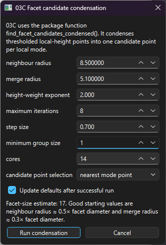
```

Expected outputs:

```text
CVxxxx_CV3D/eyeX/03_CVxxxx_eyeX_facet_candidates.csv
CVxxxx_CV3D/eyeX/inspection/03C_CVxxxx_eyeX_facet_candidate_condensation_membership.csv
```

The candidate CSV contains automatically detected facet candidates. These are not final until they have been checked in Blender.
```{r fig-20-facet-candidates-overlay, fig.cap="Automatically detected facet candidates overlaid on the local-height surface.", out.width="50%", fig.align="center", fig.pos="H"}
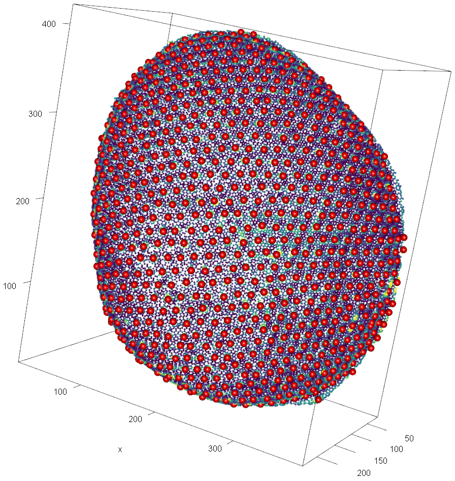
```
---

# Quality-control plotting

The Eye Workflow page provides several plotting buttons.

Available plots include:

```text
View local-height threshold plot: eyeX
Plot raw local heights 3D (PNG + optional rgl): eyeX
Plot normalized local heights 3D (PNG + optional rgl): eyeX
Plot thresholded local-height points 3D: eyeX
Plot facet candidates on local heights: eyeX
Plot facet positions on local heights: eyeX
```

The newer candidate/position overlay plots automatically choose the 2D projection with the largest spread. This avoids forcing a bad projection when the eye is tilted.

The static PNGs are saved in the background and are not automatically opened. Where available, the app asks whether to also open an interactive `rgl` 3D window.

```{r fig-21-qc-plot-buttons, fig.cap="Quality-control plotting buttons in the Eye Workflow page.", out.width="40%", fig.align="center", fig.pos="H"}
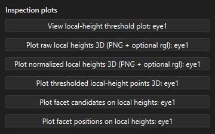
```
```{r fig-22-pretty-overlay-plot, fig.cap="Facet candidates or positions overlaid on local-height values using an automatically selected 2D projection.", out.width="50%", fig.align="center", fig.pos="H"}
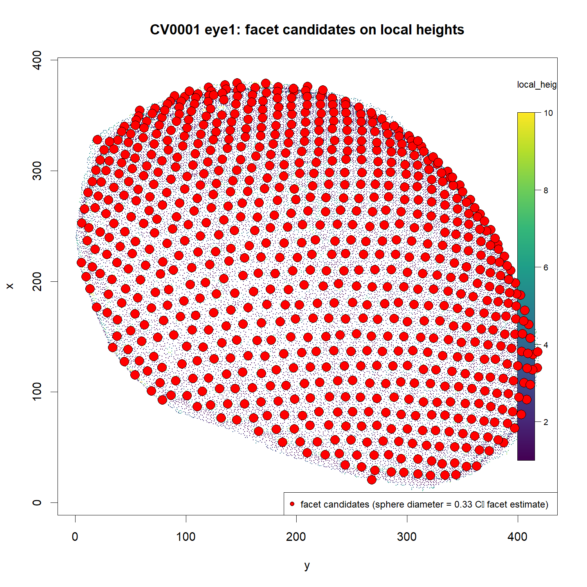
```
---

# Step 04: Blender facet position checking

After Step 03C, click:

```text
Launch Blender facet position checking: eyeX
```

Blender opens the existing eye-specific cornea `.blend` file and imports the facet candidates into the collection:

```text
CV3D_facet_candidates
```

The candidates remain in this collection. During checking, you can:

- delete false candidates
- move candidates
- add candidates at the 3D cursor
- export the checked candidate set

The checked positions are exported as:

```text
CVxxxx_CV3D/eyeX/04_CVxxxx_eyeX_facet_positions.csv
```

The collection name stays `CV3D_facet_candidates`, but after manual checking the exported CSV is considered the final facet-position file.

```{r fig-23-blender-facet-checking, fig.cap="Blender scene for checking automatically detected facet candidates.", out.width="66%", fig.align="center", fig.pos="H"}
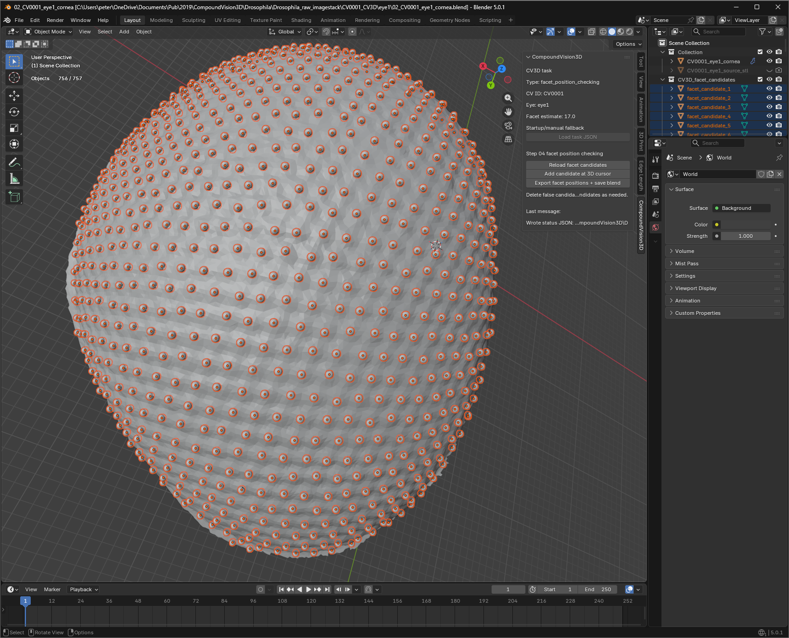
```
```{r fig-24-checked-facet-positions, fig.cap="Checked facet positions before export. The cornea mesh is coloured dark blue here to make the facet-position spheres easier to see.", out.width="66%", fig.align="center", fig.pos="H"}
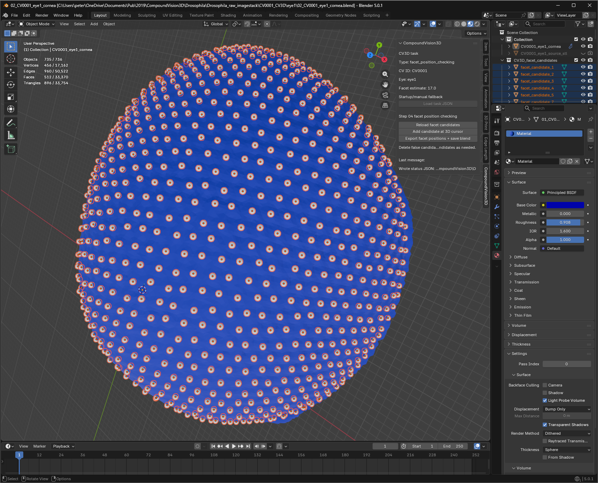
```
---

# Step 05: Head landmarking

Head landmarks are specimen-level, not eye-level. They are stored in the parent `CVxxxx_CV3D` folder.

Before launching landmarking, the head mesh must exist:

```text
CVxxxx_CV3D/01_CVxxxx_head_ImageJ.stl
```

Click:

```text
Launch Blender head landmarking
```

Blender opens a specimen-level landmarking file:

```text
CVxxxx_CV3D/05_CVxxxx_head_landmarks.blend
```

The head mesh is imported into:

```text
CV3D_head_mesh
```

The head mesh is visible, selectable, and locked in location, rotation, and scale to reduce accidental movement.

Hardcoded landmarks are:

```text
anterior
posterior
left
right
```

Use the 3D cursor to place each landmark, then export them.

Expected output:

```text
CVxxxx_CV3D/05_CVxxxx_landmarks.csv
```

```{r fig-25-head-landmarking, fig.cap="Specimen-level head landmarking in Blender.", out.width="66%", fig.align="center", fig.pos="H"}
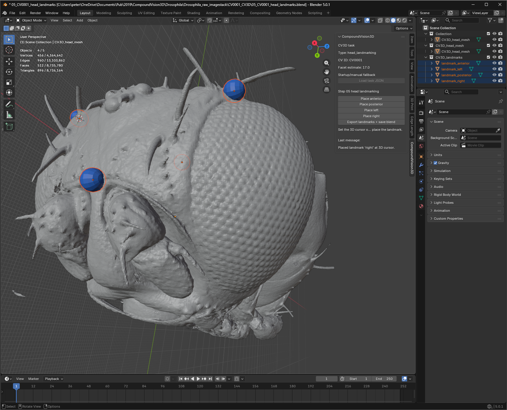
```

---

# R Analysis after landmarking

After Step 05, go to the **R Analysis** tab. This tab contains the downstream steps that turn checked facet positions and head landmarks into optical and spatial output tables.

The eye-wise sections show available steps for each eye. Completed real-eye steps use the normal completion symbol. Steps derived by mirroring are marked with:

```text
⇄
```

This means that the values were taken from a mirrored source eye and were not recalculated for the target eye.

```{r fig-29-r-analysis-page, fig.cap="R Analysis page with eye-wise 05A, 05B, and 05C analysis steps.", out.width="66%", fig.align="center", fig.pos="H"}
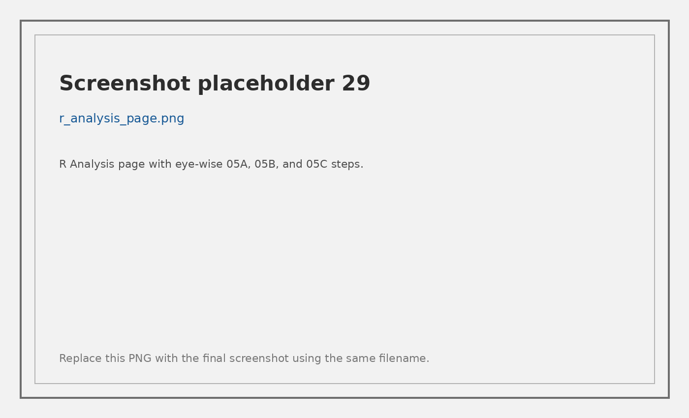
```

## Step 05A: Optical metrics

Step 05A uses the checked facet positions from Step 04 to calculate facet-level optical descriptors. Run this step after the final facet-position CSV exists:

```text
CVxxxx_CV3D/eyeX/04_CVxxxx_eyeX_facet_positions.csv
```

Click the 05A button for the relevant eye. The app writes the main optical output files into the eye folder:

```text
eyeX/05A_CVxxxx_eyeX_optic_parameters.csv
eyeX/05A_CVxxxx_eyeX_facet_normals.csv
eyeX/05A_CVxxxx_eyeX_facet_sizes.csv
eyeX/05A_CVxxxx_eyeX_interfacet_angles.csv
eyeX/05A_CVxxxx_eyeX_sensitivity_acuity.csv
eyeX/05A_CVxxxx_eyeX_optical_summary.csv
```

Important columns in later export tables include:

```text
facet_size_um
interfacet_angle_deg
sensitivity
CPD
```

Use the 05A QC plot buttons to inspect optic parameters, facet normals, and selected labelled metrics. The facet-normal plot asks for normal length as a multiple of facet size; the default is 5 times facet size.

```{r fig-30-r-analysis-05a, fig.cap="05A optical metric outputs and QC plotting controls.", out.width="66%", fig.align="center", fig.pos="H"}
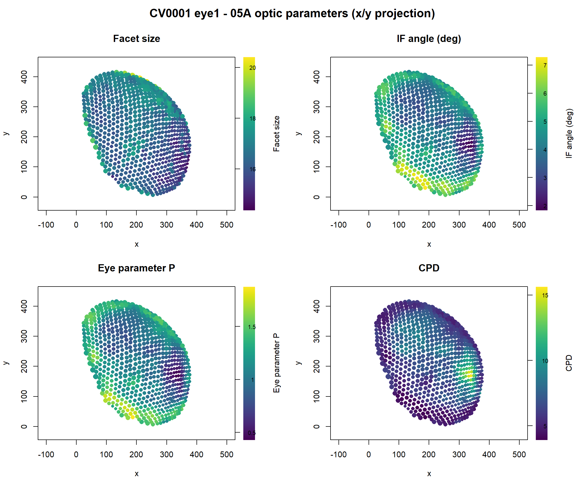
```

## Step 05B: Global coordinate rotation

Step 05B places each eye into a specimen-level coordinate frame using the head landmarks from Step 05. It also accounts for the ImageJ crop-log offsets so that eye-local coordinates are first transferred back into the head coordinate reference.

Inputs include:

```text
CVxxxx_CV3D/05_CVxxxx_landmarks.csv
eyeX/05A_CVxxxx_eyeX_optic_parameters.csv
```

Expected outputs include:

```text
eyeX/05B_CVxxxx_eyeX_landmark_referenced_coordinates.csv
eyeX/05B_CVxxxx_eyeX_global_aligned_pointcloud.csv
eyeX/05B_CVxxxx_eyeX_global_coordinates.csv
eyeX/05B_CVxxxx_eyeX_global_rotation_matrix.csv
eyeX/05B_CVxxxx_eyeX_global_coordinate_metadata.json
eyeX/05B_CVxxxx_eyeX_global_coordinate_metadata_roi_reference.csv
```

The 05B QC plot shows the globally aligned eye points together with the specimen landmarks. It is one of the most important checks before creating corneal projections.

```{r fig-31-r-analysis-05b, fig.cap="05B global-coordinate rotation outputs and QC plotting controls.", out.width="66%", fig.align="center", fig.pos="H"}
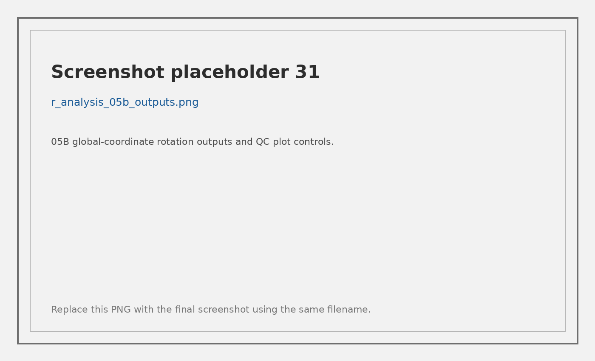
```

## Step 05C: Corneal projections

Step 05C projects the globally aligned facet points onto a projection sphere and writes latitude/longitude coordinates. These outputs make the compound eye spatially interpretable in a standardized two-dimensional angular coordinate system.

Click the 05C button for the relevant eye. The current default projection centre is:

```text
Center between eyes
```

If only one eye is available, the same dialog can still be used; check the parameters before running. The projection sphere size is entered in centimetres in the dialog and stored internally in micrometres.

Expected output:

```text
eyeX/05C_CVxxxx_eyeX_corneal_projections.csv
```

The 05C QC plot button creates corneal-projection plots, including latitude/longitude plots and 2D projection views. The optional rgl inspection window can be used for interactive 3D checking.

```{r fig-32-r-analysis-05c, fig.cap="05C corneal-projection prompt, output state, and QC plotting controls.", out.width="66%", fig.align="center", fig.pos="H"}

```

## Combined two-eye QC plots

At the bottom of the R Analysis tab, below the eye-wise sections, there are two combined QC buttons:

```text
Plot 05B global-alignment QC: both eyes
Plot 05C corneal-projection QC: both eyes
```

These buttons plot `eye1` and `eye2` together when both are available. If only one eye is available, they plot the available eye. Use these plots after mirroring or after processing both real eyes to check that the two eyes occupy the expected positions in the shared coordinate system.

```{r fig-33-combined-two-eye-qc, fig.cap="Combined two-eye 05B and 05C QC buttons below the eye-wise R Analysis sections.", out.width="66%", fig.align="center", fig.pos="H"}
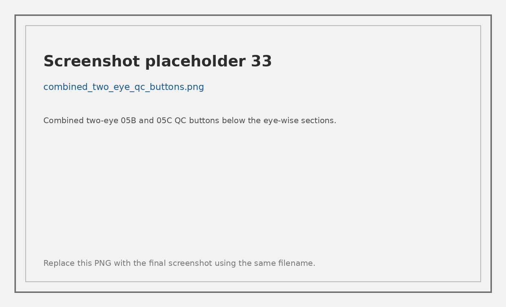
```

---

# Mirroring

The **Mirroring** page creates a mirrored target eye from an already processed source eye. This is useful when one eye is missing, damaged, or intentionally replaced by a mirrored copy for a two-eye visualization.

Choose:

- source eye
- target anatomical eye
- mirror plane

The current default mirror plane is:

```text
YZ plane
```

Mirroring writes into the actual target eye folder:

```text
eye1/
eye2/
```

It no longer creates separate `eye2_mirrored_from_eye1_*` folders. If you mirror again, the target eye's 04/05A/05B/05C outputs and old target QC plots are overwritten.

Mirroring includes the available outputs from checked facet positions through corneal projections:

```text
04 facet positions
05A optical outputs
05B global-coordinate outputs
05C corneal projections
```

Optical values and corneal projections are mirrored from existing outputs; they are not recalculated. Specimen-level head landmarks are not mirrored. They remain the real landmarks of the head.

After mirroring, the Workflow and R Analysis tabs mark mirrored-derived steps with `⇄`. Normal R Analysis plot buttons are available for mirrored target eyes where the corresponding mirrored files exist. Calculation buttons are disabled for mirrored eyes to avoid accidentally replacing mirrored-derived values by recomputed values.

```{r fig-34-mirroring-actual-eye, fig.cap="Mirroring page after creating a mirrored target eye in the actual eye folder.", out.width="66%", fig.align="center", fig.pos="H"}

```

---

# Results / Export

Go to **Results / Export**.

This tab creates the analysis-ready handoff outputs for the specimen. It is not meant to perform biological interpretation. Instead, it summarizes the processed eyes, writes clean tables, and creates a compact QC report.

Available actions are:

```text
Generate analysis-ready tables
Generate QC PDF report
Create export ZIP
Open final export folder
```

All outputs created from this tab are written into one final export folder:

```text
CVxxxx_CV3D/06_CVxxxx_results_export/
```

The table export creates:

```text
06_CVxxxx_facet_level_analysis_ready.csv
06_CVxxxx_eye_summary.csv
06_CVxxxx_specimen_summary.csv
06_CVxxxx_export_metadata.json
06_CVxxxx_export_manifest.csv
```

The facet-level table is the main handoff file. It uses code-accessible column names, for example:

```text
cv_id
eye
facet_id
data_origin
mirrored
mirrored_from_eye
mirror_plane
x_global
y_global
z_global
norm.x_global
norm.y_global
norm.z_global
facet_size_um
interfacet_angle_deg
sensitivity
CPD
corn.proj.x
corn.proj.y
corn.proj.z
latitude
longitude
projection_sphere_center_x
projection_sphere_center_y
projection_sphere_center_z
projection_sphere_radius_um
projection_center_mode
```

The QC PDF report creates a compact specimen-level document with metadata, summary tables, optic-parameter barplots, and a CP latitude/longitude plot. The current PDF creation does not require `matplotlib`; it uses built-in PDF drawing.

```{r fig-35-results-export, fig.cap="Results / Export page with readiness, table export, PDF report, ZIP export, and final export folder.", out.width="66%", fig.align="center", fig.pos="H"}
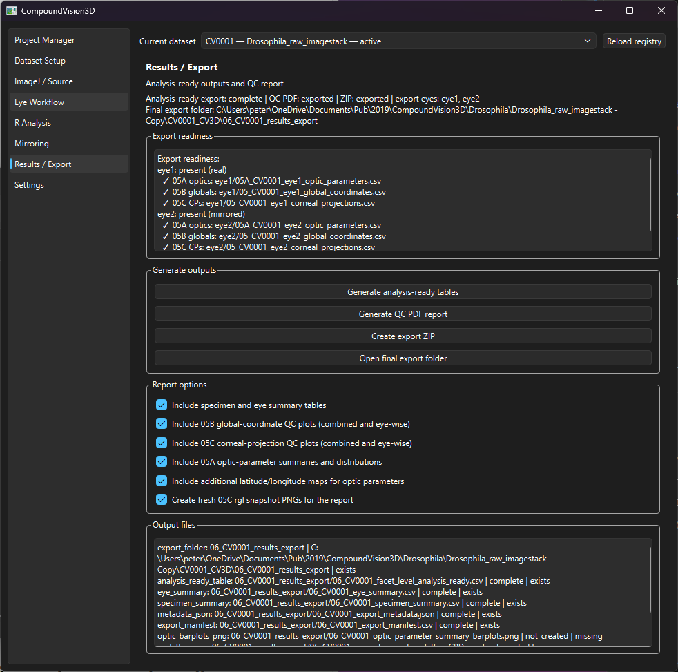
```

```{r fig-36-final-export-folder, fig.cap="Final 06 results export folder with analysis-ready tables, report, plots, manifest, and ZIP package.", out.width="66%", fig.align="center", fig.pos="H"}
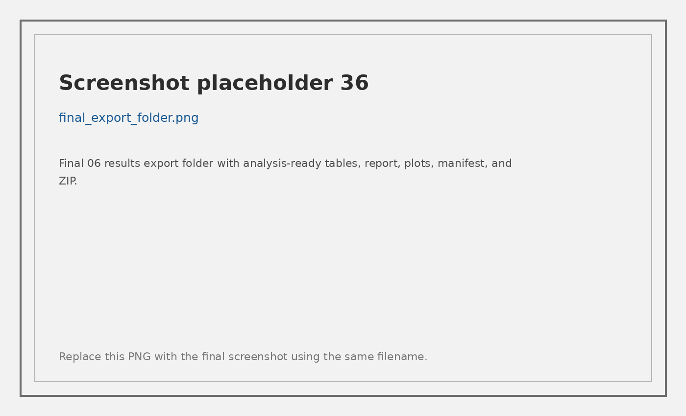
```

---

# Expected output structure

A typical dataset folder should look approximately like this after the complete workflow:

```text
CV0001_CV3D/
|--- 00_CV0001_project_config.json
|--- 00_CV0001_status.json
|--- 00_CV0001_run_log.csv
|--- 01_CV0001_head.nrrd
|--- 01_CV0001_head_ImageJ.stl
|--- 01_CV0001_facet_size_estimate.csv
|--- 05_CV0001_head_landmarks.blend
|--- 05_CV0001_landmarks.csv
|--- 06_CV0001_results_export/
|  |--- 06_CV0001_facet_level_analysis_ready.csv
|  |--- 06_CV0001_eye_summary.csv
|  |--- 06_CV0001_specimen_summary.csv
|  |--- 06_CV0001_export_metadata.json
|  |--- 06_CV0001_export_manifest.csv
|  |--- 06_CV0001_analysis_ready_export_QC_report.pdf
|  |--- 06_CV0001_results_export.zip
|--- json/
|--- logs/
|--- eye1/
|  |--- 01_CV0001_eye1.nrrd
|  |--- 01_CV0001_eye1_ImageJ.stl
|  |--- 02_CV0001_eye1_cornea.blend
|  |--- 02_CV0001_eye1_cornea.stl
|  |--- 03_CV0001_eye1_triangles_normals.csv
|  |--- 03_CV0001_eye1_local_heights.csv
|  |--- 03_CV0001_eye1_local_heights_normalized.csv
|  |--- 03_CV0001_eye1_local_height_thresholded.csv
|  |--- 03_CV0001_eye1_facet_candidates.csv
|  |--- 04_CV0001_eye1_facet_positions.csv
|  |--- 05A_CV0001_eye1_optic_parameters.csv
|  |--- 05A_CV0001_eye1_facet_normals.csv
|  |--- 05A_CV0001_eye1_facet_sizes.csv
|  |--- 05A_CV0001_eye1_interfacet_angles.csv
|  |--- 05A_CV0001_eye1_sensitivity_acuity.csv
|  |--- 05A_CV0001_eye1_optical_summary.csv
|  |--- 05B_CV0001_eye1_landmark_referenced_coordinates.csv
|  |--- 05B_CV0001_eye1_global_aligned_pointcloud.csv
|  |--- 05B_CV0001_eye1_global_coordinates.csv
|  |--- 05B_CV0001_eye1_global_rotation_matrix.csv
|  |--- 05B_CV0001_eye1_global_coordinate_metadata.json
|  |--- 05C_CV0001_eye1_corneal_projections.csv
|  |--- inspection/
|  |--- json/
|  |--- logs/
|--- eye2/
   |--- ...
```

Scientific output files are kept in the dataset, eye, or final `06_*_results_export` folders. Task metadata and logs should live in `json/` and `logs/` subfolders.

---

# Troubleshooting

## Fiji/ImageJ does not start

Check the **ImageJ/Fiji executable** path in Settings. It should point to the executable file, not only the Fiji folder.

## The ImageJ macro cannot find expected NRRD files

Run **ImageJ preprocessing** first and then click **Check ImageJ/source outputs**. The STL extraction step requires the cropped NRRD files from preprocessing.

## 3D Viewer shows more than one surface or old surfaces

Close the 3D Viewer window before continuing. The current mesh extraction workflow should close the preview 3D Viewer before opening the final full-resolution 3D Viewer, but manual cleanup may still be needed in some Fiji sessions.

## The STL is saved but the app says it is missing

Check whether the STL was saved exactly to the expected path shown by the macro. For example:

```text
CVxxxx_CV3D/eye1/01_CVxxxx_eye1_ImageJ.stl
```

If it was saved into the parent folder or with a different name, move or rename it to the expected path and run **Check ImageJ/source outputs**.

## Blender opens but the CV3D panel is not visible

Open the right sidebar in the 3D View. The panel category is:

```text
CompoundVision3D
```

## Step 03A is disabled

Step 03A requires a completed Step 02 cornea STL. Check that the following exists:

```text
CVxxxx_CV3D/eyeX/02_CVxxxx_eyeX_cornea.stl
```

## Normalization is disabled

Normalization requires Step 03A output:

```text
CVxxxx_CV3D/eyeX/03_CVxxxx_eyeX_local_heights.csv
```

## Facet position plotting is disabled

Facet position plotting requires completed Step 04 output:

```text
CVxxxx_CV3D/eyeX/04_CVxxxx_eyeX_facet_positions.csv
```

## R step fails immediately

Check:

- Rscript executable path
- CompoundVision3D R package installation
- helper-script paths
- stdout/stderr logs in the eye-specific `logs/` folder

---

## 05A, 05B, or 05C buttons are disabled

Check that upstream outputs exist. In particular:

```text
05A requires eyeX/04_CVxxxx_eyeX_facet_positions.csv
05B requires 05_CVxxxx_landmarks.csv and 05A outputs
05C requires 05B global-coordinate outputs
```

If the dataset was opened after moving folders or after a patch, use the current app version. It rebuilds many workflow states from the actual output files on disk.

## 05B global alignment looks wrong

First check the 05B QC plot. The landmarks should be the real specimen-level landmarks. For mirrored eyes, landmark coordinates should remain unchanged; only eye/facet-derived rows are mirrored.

If the eye appears translated incorrectly, inspect the ImageJ crop-log and the 05B ROI-reference output:

```text
eyeX/05B_CVxxxx_eyeX_global_coordinate_metadata_roi_reference.csv
```

## 05C corneal projection looks shifted

Check the 05C parameters used in the task/status JSON and rerun the CP step if needed. The default projection centre is now `Center between eyes`. The projection sphere diameter is entered in centimetres in the dialog and stored internally in micrometres.

## Mirroring overwrote the target eye

This is expected. Mirroring now writes into the actual target eye folder and overwrites target-eye 04/05A/05B/05C outputs. Use mirroring only when the target eye should be replaced by a mirrored source eye.

## Results / Export files are missing

All outputs from the Results / Export tab are written to:

```text
CVxxxx_CV3D/06_CVxxxx_results_export/
```

Use **Open final export folder** in the Results / Export tab.

## QC PDF report does not open or is empty

First generate the analysis-ready tables, then generate the QC PDF report. If the source tables contain no valid CPD or latitude/longitude values, the report should still be created, but the CP plot may be empty or labelled as unavailable.

---

# Appendix: Meaning of the main output files

## ImageJ outputs

- `01_CVxxxx_head.nrrd` - Cropped head volume.
- `01_CVxxxx_head_ImageJ.stl` - Head mesh exported from ImageJ/3D Viewer.
- `01_CVxxxx_facet_size_estimate.csv` - Dataset-level facet-size estimate.
- `eyeX/01_CVxxxx_eyeX.nrrd` - Cropped eye volume.
- `eyeX/01_CVxxxx_eyeX_ImageJ.stl` - Eye mesh exported from ImageJ/3D Viewer.

## Blender Step 02 outputs

- `eyeX/02_CVxxxx_eyeX_cornea.blend` - Eye-specific Blender working file.
- `eyeX/02_CVxxxx_eyeX_cornea.stl` - Extracted corneal STL.

## R Step 03 outputs

- `eyeX/03_CVxxxx_eyeX_triangles_normals.csv` - Triangle centre points and normals from the cornea STL.
- `eyeX/03_CVxxxx_eyeX_local_heights.csv` - Raw local-height values.
- `eyeX/03_CVxxxx_eyeX_local_heights_normalized.csv` - Optional normalized local-height values.
- `eyeX/03_CVxxxx_eyeX_local_height_thresholded.csv` - Points above the selected local-height threshold.
- `eyeX/03_CVxxxx_eyeX_facet_candidates.csv` - Automatically detected facet candidate points.

## Blender Step 04 and Step 05 outputs

- `eyeX/04_CVxxxx_eyeX_facet_positions.csv` - Manually checked final facet positions.
- `05_CVxxxx_head_landmarks.blend` - Specimen-level Blender landmarking file.
- `05_CVxxxx_landmarks.csv` - Head landmarks: anterior, posterior, left, and right.

## R Step 05A outputs

- `eyeX/05A_CVxxxx_eyeX_optic_parameters.csv` - Main facet-level optical-parameter table.
- `eyeX/05A_CVxxxx_eyeX_facet_normals.csv` - Facet positions and normals used for normal QC plots.
- `eyeX/05A_CVxxxx_eyeX_facet_sizes.csv` - Facet-size measurements.
- `eyeX/05A_CVxxxx_eyeX_interfacet_angles.csv` - Interfacet-angle measurements.
- `eyeX/05A_CVxxxx_eyeX_sensitivity_acuity.csv` - Sensitivity and CPD-related optical outputs.
- `eyeX/05A_CVxxxx_eyeX_optical_summary.csv` - Eye-level optical summary values.

## R Step 05B outputs

- `eyeX/05B_CVxxxx_eyeX_landmark_referenced_coordinates.csv` - Eye/facet coordinates translated into the head reference frame before final alignment.
- `eyeX/05B_CVxxxx_eyeX_global_aligned_pointcloud.csv` - Combined aligned point cloud used for QC, including facets and real specimen landmarks.
- `eyeX/05B_CVxxxx_eyeX_global_coordinates.csv` - Facet-level global coordinates and global normals.
- `eyeX/05B_CVxxxx_eyeX_global_rotation_matrix.csv` - Rotation matrix used for the global coordinate transformation.
- `eyeX/05B_CVxxxx_eyeX_global_coordinate_metadata.json` - Metadata for the global coordinate transformation.
- `eyeX/05B_CVxxxx_eyeX_global_coordinate_metadata_roi_reference.csv` - ImageJ crop-log/ROI reference information used to translate eye-local coordinates into the head frame.

## R Step 05C outputs

- `eyeX/05C_CVxxxx_eyeX_corneal_projections.csv` - Facet-level corneal projection coordinates, latitude, and longitude.

## Results / Export outputs

- `06_CVxxxx_results_export/06_CVxxxx_facet_level_analysis_ready.csv` - Main analysis-ready facet-level export table.
- `06_CVxxxx_results_export/06_CVxxxx_eye_summary.csv` - Eye-level summary table.
- `06_CVxxxx_results_export/06_CVxxxx_specimen_summary.csv` - Specimen-level summary table.
- `06_CVxxxx_results_export/06_CVxxxx_export_metadata.json` - Export metadata and provenance.
- `06_CVxxxx_results_export/06_CVxxxx_export_manifest.csv` - Manifest of exported files.
- `06_CVxxxx_results_export/06_CVxxxx_analysis_ready_export_QC_report.pdf` - Compact QC PDF report.
- `06_CVxxxx_results_export/06_CVxxxx_results_export.zip` - ZIP package of the final export.

---

# End of tutorial

This tutorial describes the current pre-release workflow through analysis-ready export. Later optional biological analyses, such as field-of-view summaries or regional visual specialization, should be treated as downstream analyses rather than core pipeline output.
